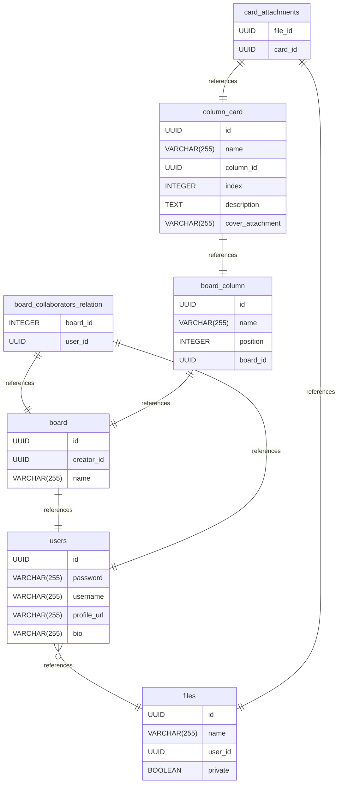

# board-app.sql.schema documentation
## Summary

- [Introduction](#introduction)
- [Database Type](#database-type)
- [Table Structure](#table-structure)
	- [users](#users)
	- [files](#files)
	- [board](#board)
	- [board_collaborators_relation](#board_collaborators_relation)
	- [board_column](#board_column)
	- [column_card](#column_card)
	- [card_attachments](#card_attachments)
- [Relationships](#relationships)
- [Database Diagram](#database-Diagram)

## Introduction

## Database type

- **Database system:** PostgreSQL
## Table structure

### users

| Name        | Type          | Settings                      | References                    | Note                           |
|-------------|---------------|-------------------------------|-------------------------------|--------------------------------|
| **id** | UUID | 🔑 PK, not null , unique | users_id_fk | |
| **password** | VARCHAR(255) | not null  |  | |
| **username** | VARCHAR(255) | not null , unique |  | |
| **profile_url** | VARCHAR(255) | not null  |  | |
| **bio** | VARCHAR(255) | not null  |  | | 

### files

| Name        | Type          | Settings                      | References                    | Note                           |
|-------------|---------------|-------------------------------|-------------------------------|--------------------------------|
| **id** | UUID | 🔑 PK, not null , unique |  | |
| **name** | VARCHAR(255) | not null  |  | |
| **user_id** | UUID | not null  |  | |
| **private** | BOOLEAN | not null  |  | | 

### board

| Name        | Type          | Settings                      | References                    | Note                           |
|-------------|---------------|-------------------------------|-------------------------------|--------------------------------|
| **id** | UUID | 🔑 PK, not null , unique |  | |
| **creator_id** | UUID | not null  | board_creator_id_fk | |
| **name** | VARCHAR(255) | not null  |  | | 

### board_collaborators_relation

| Name        | Type          | Settings                      | References                    | Note                           |
|-------------|---------------|-------------------------------|-------------------------------|--------------------------------|
| **board_id** | INTEGER | 🔑 PK, not null , unique, autoincrement | board-collaborators_board_id_fk | |
| **user_id** | UUID | 🔑 PK, not null  | board-collaborators_user_id_fk | | 

### board_column

| Name        | Type          | Settings                      | References                    | Note                           |
|-------------|---------------|-------------------------------|-------------------------------|--------------------------------|
| **id** | UUID | 🔑 PK, not null , unique |  | |
| **name** | VARCHAR(255) | not null  |  | |
| **position** | INTEGER | not null , unique |  | |
| **board_id** | UUID | not null  | board_column_board_id_fk | | 

### column_card

| Name        | Type          | Settings                      | References                    | Note                           |
|-------------|---------------|-------------------------------|-------------------------------|--------------------------------|
| **id** | UUID | 🔑 PK, not null , unique |  | |
| **name** | VARCHAR(255) | not null  |  | |
| **column_id** | UUID | 🔑 PK, not null  | column_card_column_id_fk | |
| **index** | INTEGER | not null , unique |  | |
| **description** | TEXT | not null  |  | |
| **cover_attachment** | VARCHAR(255) | not null  |  | | 

### card_attachments

| Name        | Type          | Settings                      | References                    | Note                           |
|-------------|---------------|-------------------------------|-------------------------------|--------------------------------|
| **file_id** | UUID | 🔑 PK, not null  | card_attachment_file_id_fk | |
| **card_id** | UUID | 🔑 PK, not null  | card_attachment_card_id_fk | | 

## Relationships

- **users to files**: one_to_many
- **board to users**: one_to_one
- **board_collaborators_relation to board**: one_to_one
- **board_collaborators_relation to users**: one_to_one
- **board_column to board**: one_to_one
- **column_card to board_column**: one_to_one
- **card_attachments to column_card**: one_to_one
- **card_attachments to files**: one_to_one

## Database Diagram

